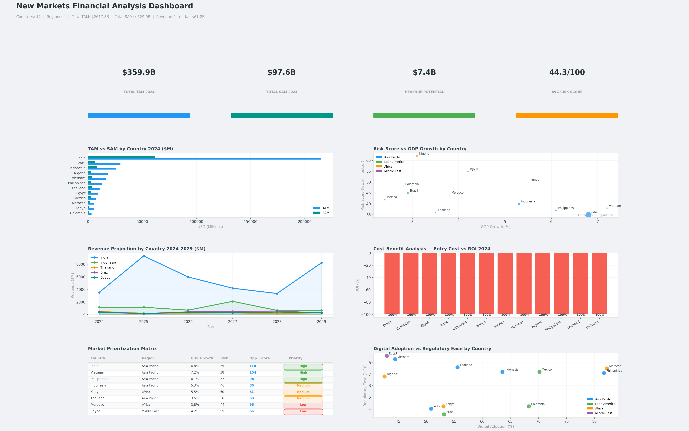

# New Markets Financial Analysis

An end-to-end new markets financial analysis project covering CBA,
TAM/SAM market sizing, revenue projections, risk analysis, and market
prioritization across 12 countries and 4 regions (2024-2029).

## Market Summary
- **Countries Analyzed:** 12
- **Regions:** Asia Pacific, Latin America, Africa, Middle East
- **Years Projected:** 2024-2029
- **Total TAM:** $2,617.8B
- **Total SAM:** $629.0B
- **Total Revenue Potential:** $61.2B
- **Avg Risk Score:** 44.3/100

## Dashboard Visualizations

## Dashboard Sections
1. **KPI Cards** — TAM, SAM, Revenue Potential, Avg Risk Score
2. **TAM vs SAM by Country** — Side by side comparison
3. **Risk Score vs GDP Growth** — Bubble chart (size = population)
4. **Revenue Projection Trend** — 2024-2029 line chart for top 5 markets
5. **Cost-Benefit Analysis** — Entry Cost vs ROI by country
6. **Market Prioritization Matrix** — Ranked table with opportunity scores
7. **Digital Adoption vs Regulatory Ease** — Scatter plot by region

## Top Priority Markets
| Country | GDP Growth | Risk Score | Priority |
|---|---|---|---|
| Vietnam | 7.2% | 38 | High |
| India | 6.8% | 35 | High |
| Philippines | 6.1% | 37 | High |
| Indonesia | 5.3% | 40 | Medium |
| Kenya | 5.5% | 50 | Medium |

## Countries Analyzed
Asia Pacific: India, Vietnam, Indonesia, Philippines, Thailand
Latin America: Brazil, Mexico, Colombia
Africa: Nigeria, Kenya, Morocco
Middle East: Egypt

## Technologies
- Python, Pandas, NumPy
- Matplotlib, Seaborn
- Google Colab (T4 GPU)
